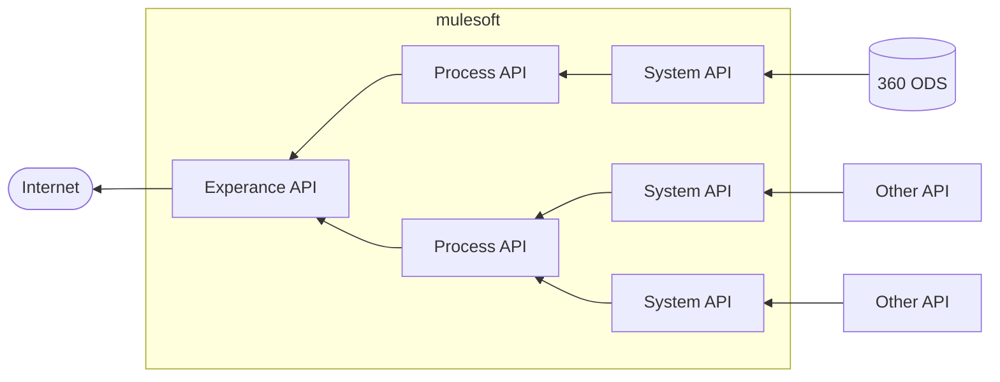

# WEDO Mulesoft

## Architecture

```mermaid
flowchart RL

usr([Internet])
exp[Experance API]
proc1[Process API]
proc2[Process API]
sapiother1[System API]
sapiother2[System API]
other1[Other API]
other2[Other API]
sapi[System API]
db[(360 ODS)]


exp --> usr
subgraph region1 [mulesoft]
proc1 --> exp
proc2 --> exp
sapiother1 --> proc2
sapiother2 --> proc2
sapi --> proc1
end
other1 --> sapiother1
other2 --> sapiother2
db --> sapi
```
